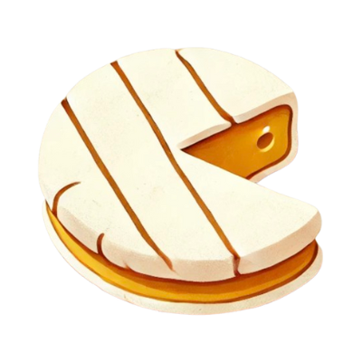

  

  <strong>⚡️ Capture screenshots, console errors, network issues, and user actions, giving developers full context instantly.</strong>

 

  <a href="https://go.briehq.com/github" target="_blank">Repo</a> •
  <a href="https://go.briehq.com/lp" target="_blank">Website</a> •
  <a href="https://go.briehq.com/discord" target="_blank">Discord</a> •
  <a href="https://go.briehq.com/docs" target="_blank">Docs</a>

